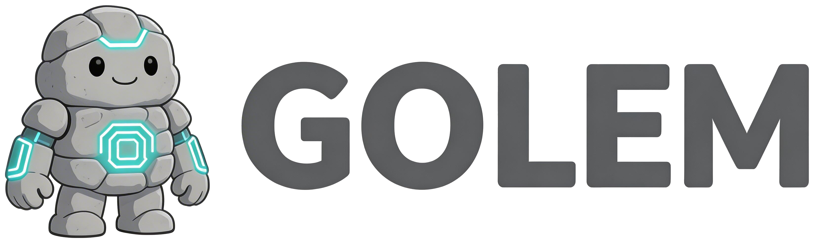

# Golem

<p align="center">
  
</p>

**An AI agent framework with a ReAct loop, built in Go.**

Golem is a Go clone of [CrabClaw](https://github.com/jackwener/crabclaw), an OpenClaw-compatible agentic coding toolchain written in Rust.

---

## Highlights

<div class="grid cards" markdown>

- :material-robot: **ReAct Loop** — Reason-Act-Observe cycle with parallel tool execution
- :material-tools: **20+ Built-in Tools** — File ops, shell, web, Lark, scheduling, and more
- :material-brain: **Multiple LLM Providers** — OpenAI, Anthropic, any OpenAI-compatible service
- :material-book-open: **Skill System** — Two-scope skill discovery with runtime creation
- :material-shield-check: **Safety First** — Filesystem/shell sandboxing, secret redaction, per-tool ACLs
- :material-memory: **Context Management** — Three strategies: anchor, masking, hybrid
- :material-account-group: **Persona System** — Three-layer identity: SOUL.md, AGENTS.md, MEMORY.md
- :material-chat: **Multi-Channel** — CLI REPL with streaming, Lark/Feishu bot via WebSocket

</div>

## Quick Start

```sh
# Build
make build

# Configure
cp .env.example .env
# Set GOLEM_MODEL and API key, e.g.:
#   GOLEM_MODEL=openai:gpt-4o
#   OPENAI_API_KEY=sk-...

# Run
make run
```

See the [Getting Started](getting-started.md) guide for more details.

## Architecture

Golem's architecture is documented in detail across 13 design documents covering every major subsystem — from the core [ReAct loop](design/02-agent-session.md) and [tool system](design/06-tools.md) to [context management](design/05-context-manager.md) and [safety](design/12-safety-sandbox.md).

Start with the [Architecture Overview](design/01-architecture.md) for the big picture.

## Acknowledgements

This project is inspired by and based on [CrabClaw](https://github.com/jackwener/crabclaw) by [@jackwener](https://github.com/jackwener). Thank you for the excellent original design.
